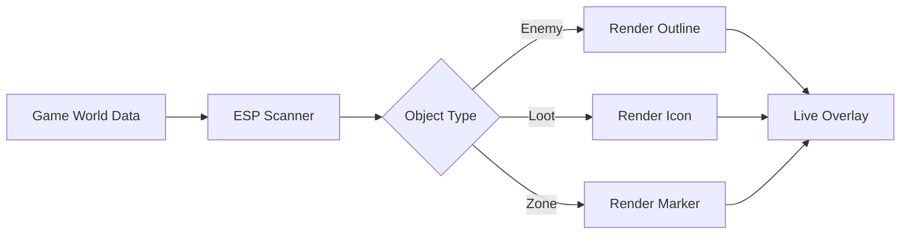

# PUBG: Black Budget ESP

In *Black Budget*, danger rarely runs toward you shouting. It waits behind walls, listens through doors, measures your footsteps. Survival is not only about aim—it is about *knowing*.

The **PUBG: Black Budget ESP** is a visual intelligence overlay designed to lift the fog just enough to let decisions breathe. Not blinding neon, not chaotic clutter—only quiet lines of information, drawn lightly over a hostile city.

This is awareness, not noise.

---

## 🧠 Overview

Crafted for **PUBG: Black Budget**, the ESP system renders real-time contextual data directly onto your screen. It does not interrupt flow; it moves with it, adapting to distance, threat, and perspective.

Guiding principles:

* Information before reaction
* Subtlety over spectacle
* Control in your hands

Whether you’re navigating interiors, scanning rooftops, or planning extraction routes, the overlay becomes a second sense—present, calm, optional.

---

## 👁 Core ESP Modules

### 🔍 Player & Threat Visualization

* Enemy outlines with distance scaling
* Visibility through walls and structures
* Threat-level color coding
* Adjustable render range

### 🧭 Positional Intelligence

* Directional indicators (off-screen)
* Line-of-sight awareness
* Height & elevation markers
* Silent update cycles (no flicker)

> [!NOTE]
> All visuals support opacity and color tuning, allowing near-invisible assistance for immersion-focused play.

---

## 📦 Loot & Environment ESP

Sometimes survival is preparation.

* Loot highlights with rarity filters
* Container & stash markers
* Weapon and ammo indicators
* Objective & extraction zone visibility

Filters ensure only what matters appears—no clutter, no distraction.

---

## ⚙ Customization & Control

The ESP is modular by design.

* Toggle each category independently
* Distance-based fade-in/out
* Preset profiles (stealth / aggressive / exploration)
* Full hotkey rebinding

You decide how loud the information speaks.

---

## ⚡ Setup & First Use

Quiet steps. Immediate clarity.

1. Launch **PUBG: Black Budget**
2. Run the ESP module as administrator
3. Wait for attachment confirmation
4. Open the overlay menu via hotkey
5. Enable only the layers you need

Example bindings:

```text
INSERT – Open / Close Menu
F1     – Enemy ESP
F2     – Loot ESP
F3     – Distance Scaling +
F4     – Distance Scaling -
F5     – Color Profile Switch
```

> [!WARNING]
> Intended for controlled or learning-focused environments. Use responsibly and understand platform rules.

---

## 🔄 Visual Logic (Conceptual)



Close the ESP, and the screen returns to silence.

---

## ❓ FAQ

**Is this wallhack-style ESP?**
Functionally, yes—but designed with restraint and heavy customization.

**Can I keep it subtle?**
Absolutely. Low opacity and short render ranges feel almost organic.

**Does it impact FPS?**
Minimal. Rendering scales with distance and object count.

**Can I disable parts quickly?**
Every module has instant hotkey toggles.

**Is this useful for map learning?**
Many players rely on ESP to study layouts, spawn logic, and flow safely.

---

## 🌒 Final Thoughts

Cities in *Black Budget* are built on secrets—rooms behind rooms, threats behind silence. The **PUBG: Black Budget ESP** does not remove fear; it reshapes it into understanding.

When you see more, you rush less.
When you rush less, you survive longer.
